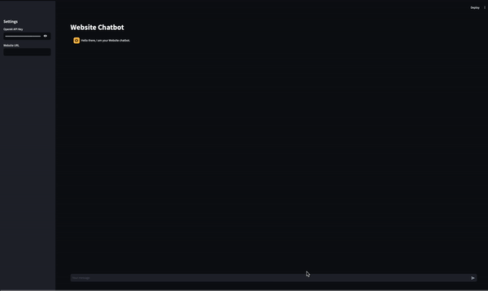

# Website Chatbot with LangChain and OpenAI

## Demo


This repository contains a Streamlit application that allows users to chat with the content of a specified website using OpenAI's GPT-4. The application leverages LangChain for managing conversation flow and embedding website content into a vector database for efficient querying.

## Features
- **Website Content Load**: Input a website URL to load its content.
- **Vector Embedding**: Parse and embed website content into a vector store using OpenAI embeddings.
- **Chat Interface**: Interact with the loaded website content through a chat interface.
- **State-of-the-Art Technologies**: Uses the latest versions of Streamlit, LangChain, and OpenAI APIs.

## Packages Used
- **streamlit**: For creating the web application interface.
- **langchain**: For managing the conversation flow and integrating with OpenAI.
- **FAISS**: For efficient vector storage and similarity search.
- **openai**: For accessing OpenAI's GPT-4 API.

## Directory Structure
```sh
WebsiteChatbot/
├── app.py
├── requirements.txt
├── sample_demo.gif
```


## Installation
1. Clone the repository:
    ```sh
    git clone https://github.com/xmpuspus/WebsiteChatbot.git
    cd WebsiteChatbot
    ```

2. Install the required packages:
    ```sh
    pip install -r requirements.txt
    ```

3. Run the Streamlit application:
    ```sh
    streamlit run app.py
    ```

## Application Overview
### Sidebar Inputs
- **OpenAI API Key**: A text input for the user to enter their OpenAI API key.
- **Website URL**: A text input for users to specify the website URL.

### Main Pane
- **Chat Interface**: Displays the chat history and allows users to input their questions.

## Approach
### Website Content Loading and Parsing
- When a user inputs a website URL, its content is loaded using the `UnstructuredURLLoader` from LangChain.
- The loaded text is concatenated into a single string.

### Vector Embedding
- The parsed website text is embedded into a vector store using `OpenAIEmbeddings` from LangChain.
- FAISS is used to store these embeddings and perform similarity searches efficiently.

### Chat Handling
- User inputs are taken from the chat interface.
- The most relevant text from the vector store is retrieved based on the user's query.
- This relevant text, combined with the user's query, is used as a prompt for OpenAI's GPT-4 to generate a response.
- The response is displayed in the chat interface.

## User Experience
1. **Enter Website URL**: Users input the URL of the website they want to chat with.
2. **Enter API Key**: Users input their OpenAI API key to enable AI responses.
3. **Chat Interaction**: Users can ask questions related to the website content, and the AI will respond based on the parsed website text.

## Security Considerations
- **Injection-Proof**: The application ensures that user inputs cannot override system instructions by strictly defining the prompt template and conversation flow.

## Future Improvements
- **Enhanced Parsing**: Improve website parsing to handle complex content better.
- **Customization**: Allow users to customize the prompt template and other settings.
- **Multi-Website Support**: Enable handling of multiple websites for a broader range of queries.

## Contributions
Contributions are welcome! Please open an issue or submit a pull request for any improvements or features you would like to see.

## License
This project is licensed under the MIT License. See the LICENSE file for more details.
